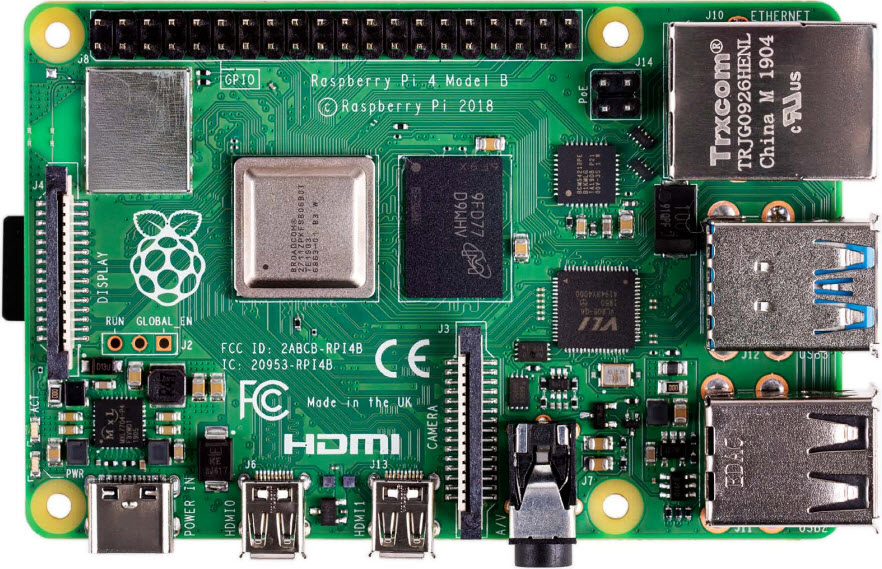
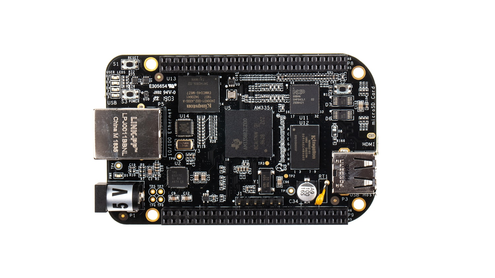

## Raspberry Pi

<!--  -->

* [Setup Raspberry Pi Zero W](/tech-notes/system/raspberrypi/raspberrypi-zerow-setup)
* [Setup PiCAN on Raspberry Pi](/tech-notes/system/raspberrypi/raspberrypi-pican)
* [Setup Xenomai on Raspberry Pi](/tech-notes/system/raspberrypi/raspberrypi-xenomai)
* [Fix USB Issue with Kernel 4.19.y-rt for Raspberry Pi](/tech-notes/system/raspberrypi/raspberrypi-rt-kernel-usb)
* [Use Chroot and Docker for ARM Application Development](/tech-notes/system/raspberrypi/raspberrypi-cross-chroot-docker)
* [Install Docker in Raspberry Pi OS](/tech-notes/system/raspberrypi/raspberrypi-install-docker)

## Beaglebone

<!--  -->

* [Setup Beaglebone](/tech-notes/system/beaglebone/beaglebone-setup)
* [Reduce Beaglebone Boot Time](/tech-notes/system/beaglebone/beaglebone-boottime)
* [Xenomai on Beaglebone](/tech-notes/system/beaglebone/beaglebone-xenomai)
* [IIO Driver for Pocketbeagle](/tech-notes/system/beaglebone/beaglebone-iio-imu)
* [Internet Share over USB for Pocketbeagle](/tech-notes/system/beaglebone/beaglebone-usb-network-share)